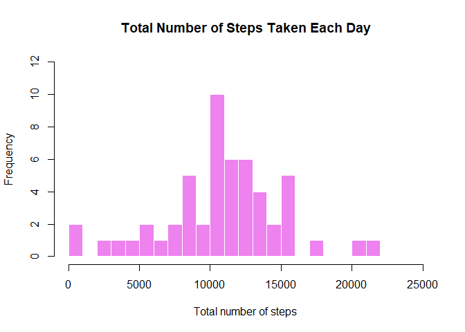
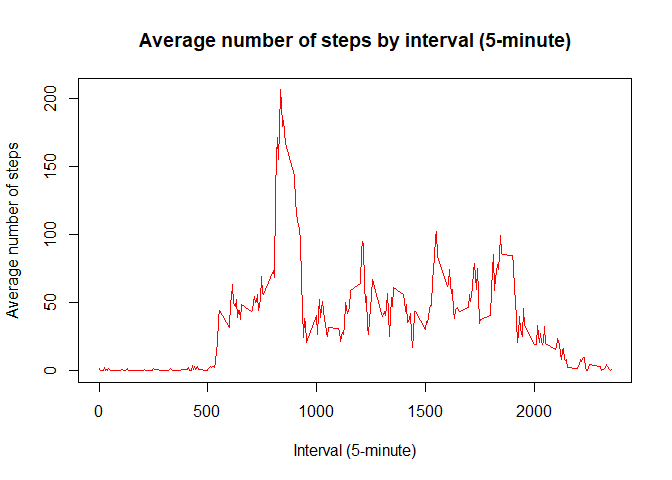
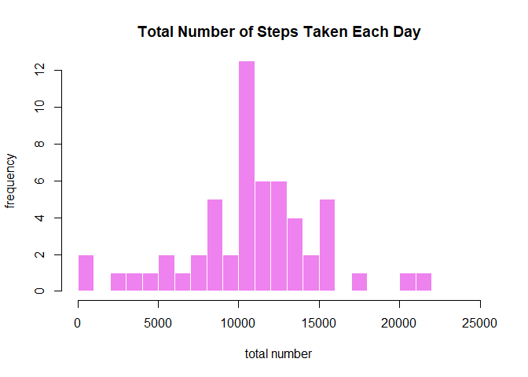
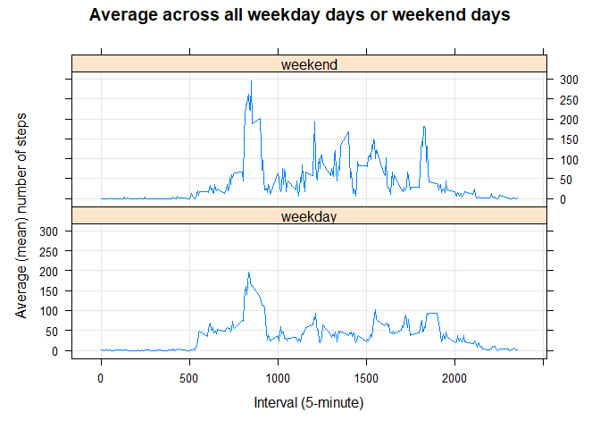

### Author: Nivaldo Hydalgo
### Date: 07 September 2021
### ======================================


## Loading and preprocessing the data


#### *Load the data*

**Download zip file repository:**

```r
if ( !file.exists("./repdata_data_activity.zip") ) {
    fileUrl <- "https://d396qusza40orc.cloudfront.net/repdata%2Fdata%2Factivity.zip?accessType=DOWNLOAD"
    download.file(fileUrl, destfile = "./repdata_data_activity.zip", method = "curl", quiet = TRUE)
}
```

**Unzip file repository:**

```r
if ( !file.exists("./activity.csv") ) {
    unzip(zipfile = "./repdata_data_activity.zip")
}
```

**Get file into R dataframe:**

```r
activity <- read.csv("./activity.csv")
summary(activity)
```

```
##      steps            date              interval     
##  Min.   :  0.00   Length:17568       Min.   :   0.0  
##  1st Qu.:  0.00   Class :character   1st Qu.: 588.8  
##  Median :  0.00   Mode  :character   Median :1177.5  
##  Mean   : 37.38                      Mean   :1177.5  
##  3rd Qu.: 12.00                      3rd Qu.:1766.2  
##  Max.   :806.00                      Max.   :2355.0  
##  NA's   :2304
```

#### *Process/transform the data*

**Transform date string from date type:**

```r
activity <- activity %>%  
    mutate( date = as.Date(date) )  
##    mutate( date = as.Date(date), interval = str_pad(interval, 4, pad = "0") ) %>% 
##    mutate( interval = as.factor( paste(substr(interval,1,2), substr(interval,3,4), sep = ":") ) )
##%>% 
##    mutate( time = as.factor( paste(substr(interval,1,2), substr(interval,3,4), sep = ":") ) ) %>% 
##    mutate( hour = as.factor( substr(time,1,2) ) )
summary(activity)
```

```
##      steps             date               interval     
##  Min.   :  0.00   Min.   :2012-10-01   Min.   :   0.0  
##  1st Qu.:  0.00   1st Qu.:2012-10-16   1st Qu.: 588.8  
##  Median :  0.00   Median :2012-10-31   Median :1177.5  
##  Mean   : 37.38   Mean   :2012-10-31   Mean   :1177.5  
##  3rd Qu.: 12.00   3rd Qu.:2012-11-15   3rd Qu.:1766.2  
##  Max.   :806.00   Max.   :2012-11-30   Max.   :2355.0  
##  NA's   :2304
```


## What is mean total number of steps taken per day?


**Calculate the total number of steps taken per day:**

```r
activity_day <- activity %>%
    filter( !is.na(steps) ) %>% 
    group_by( date ) %>% 
    summarise( steps_day = sum(steps) )
summary(activity_day)
```

```
##       date              steps_day    
##  Min.   :2012-10-02   Min.   :   41  
##  1st Qu.:2012-10-16   1st Qu.: 8841  
##  Median :2012-10-29   Median :10765  
##  Mean   :2012-10-30   Mean   :10766  
##  3rd Qu.:2012-11-16   3rd Qu.:13294  
##  Max.   :2012-11-29   Max.   :21194
```

**Make a histogram of the total number of steps taken each day:**

```r
hist(activity_day$steps_day,  
     main = "Total Number of Steps Taken Each Day", 
     xlab = "Total number of steps", ylab = "Frequency", 
     col = c("violet"), 
     border = FALSE,
     breaks = 25,
     xlim = c(0,25000), ylim = c(0,12))
```

<!-- -->

**Calculate and report the mean and median of the total number of steps taken per day:**

```r
mean_day <- as.integer( mean(activity_day$steps_day) )
median_day <- as.integer( median(activity_day$steps_day) )
mean_day
```

```
## [1] 10766
```

```r
median_day
```

```
## [1] 10765
```

Mean is 10766   
Median is 10765


## What is the average daily activity pattern?


Summarise dataset by 5-minute interval calculating average and total number of steps:

```r
activity_interval <- activity %>%
    filter( !is.na(steps) ) %>% 
    group_by( interval ) %>% 
    summarise( steps_interval = mean(steps), steps_total = sum(steps) )
summary(activity_interval)
```

```
##     interval      steps_interval     steps_total     
##  Min.   :   0.0   Min.   :  0.000   Min.   :    0.0  
##  1st Qu.: 588.8   1st Qu.:  2.486   1st Qu.:  131.8  
##  Median :1177.5   Median : 34.113   Median : 1808.0  
##  Mean   :1177.5   Mean   : 37.383   Mean   : 1981.3  
##  3rd Qu.:1766.2   3rd Qu.: 52.835   3rd Qu.: 2800.2  
##  Max.   :2355.0   Max.   :206.170   Max.   :10927.0
```

**Make a time series plot (type = "l") of the 5-minute interval (x-axis) and the average number of steps taken, averaged across all days (y-axis):**

```r
plot(activity_interval$interval, activity_interval$steps_interval, 
     type = "l", 
     col = "red",
     main = "Average number of steps by interval (5-minute)",
     xlab = "Interval (5-minute)",
     ylab = "Average number of steps"
)
```

<!-- -->

**Which 5-minute interval, on average across all the days in the dataset, contains the maximum number of steps?**

```r
max_steps <- activity_interval[ activity_interval$steps_total == max(activity_interval$steps_total), ]
max_steps
```

```
## # A tibble: 1 x 3
##   interval steps_interval steps_total
##      <int>          <dbl>       <int>
## 1      835           206.       10927
```

The 5-minute interval contains the maximum number of steps is 835.


## Imputing missing values


**Attention:** 
*Note that there are a number of days/intervals where there are missing values.* 
*The presence of missing days may introduce bias into some calculations or summaries of the data.*

**Calculate and report the total number of missing values in the dataset:**

```r
total_na <- sum( is.na(activity$steps) ) 
total_na
```

```
## [1] 2304
```

Total number of missing values is 2304    
    
**Devise a strategy for filling in all of the missing values in the dataset:**     
*The strategy does not need to be sophisticated. 
For example, you could use the mean/median for that day, or the mean for that 5-minute interval, etc.*

#### The strategy for missing values is to impute the mean of the respective interval.


**Create a new dataset that is equal to the original dataset but with the missing data filled in:**

```r
activity_no_na <- activity %>% 
    group_by( interval ) %>% 
    mutate( steps = ifelse( is.na(steps) , mean( steps , na.rm = TRUE), steps ) )
total_na <- sum( is.na(activity_no_na$steps) ) 
total_na
```

```
## [1] 0
```

Summarise dataset by date calculating total number of steps:

```r
activity_no_na_total <- activity_no_na %>%
    group_by( date ) %>% 
    summarise( steps_total = sum(steps) ) 
```

**Make a histogram of the total number of steps taken each day and Calculate:** 

```r
hist( activity_no_na_total$steps_total,  
     main = "Total Number of Steps Taken Each Day", 
     xlab = "total number", ylab = "frequency", 
     col = c("violet"), 
     border = FALSE,
     breaks = 25,
     xlim = c(0,25000), ylim = c(0,12))
```

<!-- -->
   
**Calculate and report the mean and median total number of steps taken per day:** 

```r
mean <- as.integer( mean(activity_no_na_total$steps_total) )
median <- as.integer( median(activity_no_na_total$steps_total) )
mean
```

```
## [1] 10766
```

```r
median
```

```
## [1] 10766
```

Mean is 10766   
Median is 10766

**Do these values differ from the estimates from the first part of the assignment?** 

#### Values do not differ  from the estimates from the first part of the assignment.

**What is the impact of imputing missing data on the estimates of the total daily number of steps?**

#### There was no relevant impact.
    
    
## Are there differences in activity patterns between weekdays and weekends?


**Attention:**
*For this part the weekdays() function may be of some help here. 
Use the dataset with the filled-in missing values for this part.*

**Create a new factor variable in the dataset with two levels – “weekday” and “weekend” indicating whether a given date is a weekday or weekend day:**

```r
activity_week <- activity_no_na %>% 
    mutate( week = as.factor( ifelse( wday(date) %in% c(0, 6) , "weekend", "weekday") ) ) %>% 
    group_by( week, interval ) %>% 
    summarise( steps_interval = mean(steps), .groups = 'drop' )
summary(activity_week)
```

```
##       week        interval      steps_interval   
##  weekday:288   Min.   :   0.0   Min.   :  0.000  
##  weekend:288   1st Qu.: 588.8   1st Qu.:  1.833  
##                Median :1177.5   Median : 24.699  
##                Mean   :1177.5   Mean   : 39.162  
##                3rd Qu.:1766.2   3rd Qu.: 56.060  
##                Max.   :2355.0   Max.   :296.310
```

**Make a panel plot containing a time series plot (type = "l") of the 5-minute interval (x-axis) and the average number of steps taken, averaged across all weekday days or weekend days (y-axis):**   
*See the README file in the GitHub repository to see an example of what this plot should look like using simulated data.*

```r
with( activity_week, 
      xyplot(
            steps_interval ~ interval | week, 
            layout = c(1, 2), 
            type=c("l","g"),
            xlab="Interval (5-minute)",
            ylab="Average (mean) number of steps",
            main="Average across all weekday days or weekend days"
      )
)
```

<!-- -->
    
